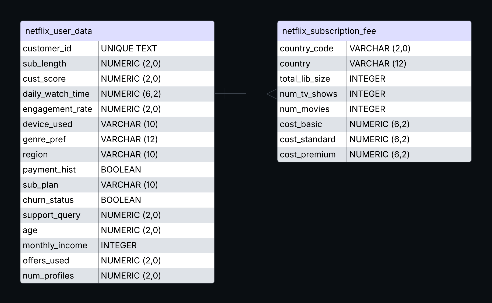

# Project Background
Netflix has been seeing an increasing churn rate amongst their subscribers. The goal of the project is to find factors that lead to Netflix user churn rates using a given dataset on consumer information and interaction. Insights from identified churn rates and how they affect segmented groups will inform recommendations to the marketing team to target advertising campaigns to adhere to these with higher churn rates than others.

### Insights and Recommendations are provided on the following areas:

- **Churn Cause Analysis**: Determining and analyzing the outlying factors that cause a Netflix subscriber to cancel their subscription, pinpointing reasons that have the greatest churn cause in relation to customer segmentation.
- **Subscription Price Analysis**: Using sales data from subsciption price per region and plan price to guide marketing decisions.
- **Customer Segmentation**: Grouping customers into certain groups based on age, subscription type, plan, and region and providing descriptive statistics on each group to make comparisons and inform targetted marketing strategies.

# Data Structure and Caveats

The data structure consists of two csv files: `netflix_user_data.csv` and `netflix_subscription_fee.csv`, containing data on netflix data based on individual, unnamed users and subscription fee based on country and plan type. The first table on user data was found on Kaggle, and synthesized to increase record count to resemble uncleaned business data, and the subscription fee table retrieved from Kaggle contains information per country, a key that is changed to fit the user data table through SQL.

In project relation, following the given task of analyzing customer churn reasons and sale data to guide marketing decisions, I retrieved the information on user data from the Customer data sector, and the subscription fee prices for countries from the revenue sector. 

Data cleaning efforts, added columns, and validation checks were conducted to ensure data was ready for analysis. Those processes are outlined "here".

Refer to issues log and note insights about data cleaning; identify clear, null / unfixable values and magnitude in business analysis

