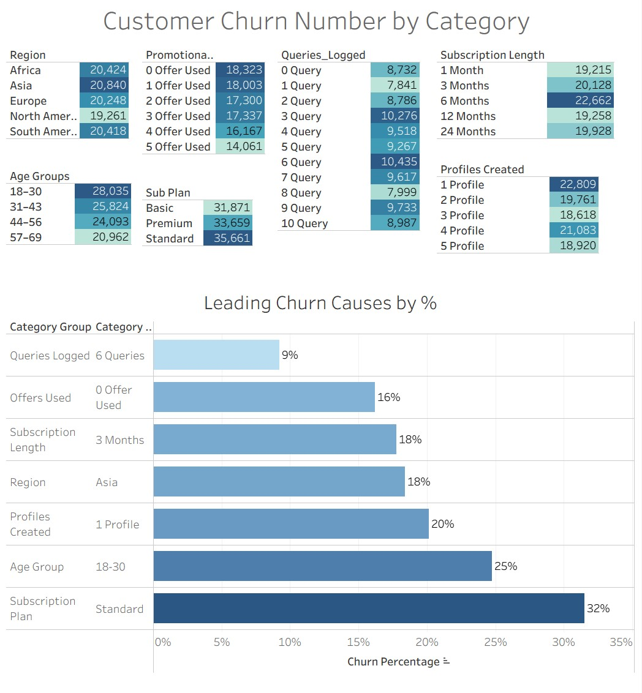
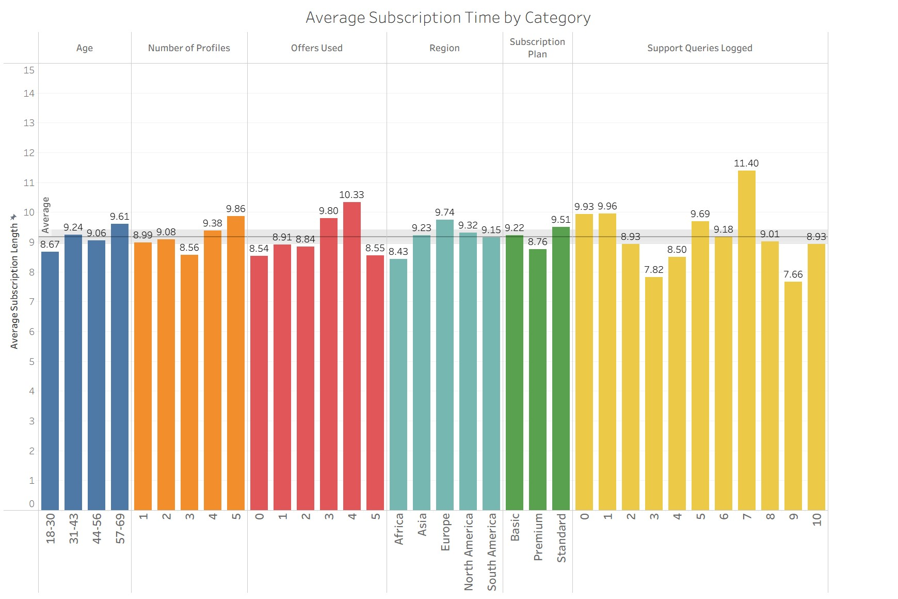
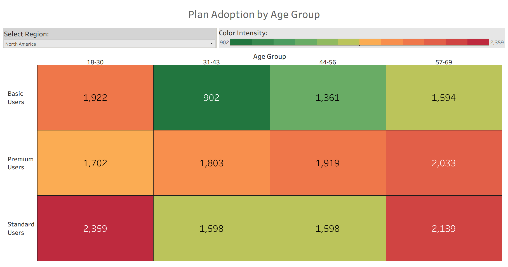
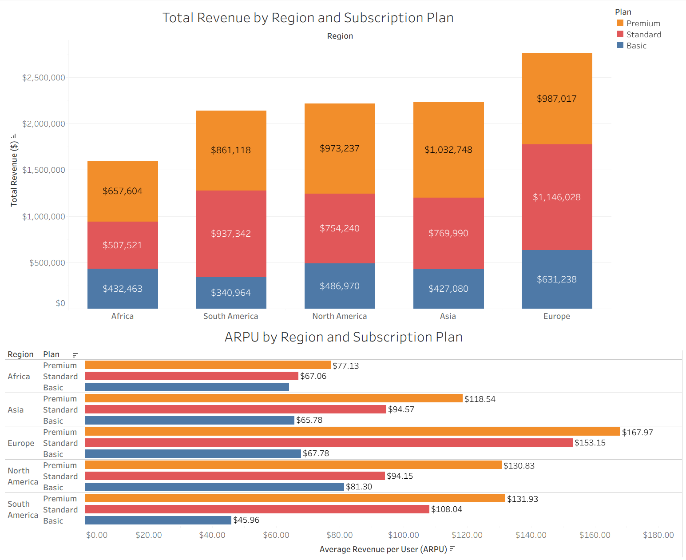

# Project Background
Netflix has been seeing an increasing churn rate amongst their subscribers. The goal of the project is to find factors that lead to Netflix user churn rates using a given dataset on consumer information and interaction. Insights from identified churn rates and how they affect segmented groups will inform recommendations to the marketing team to target advertising campaigns to adhere to these with higher churn rates than others.

### Insights and Recommendations are provided on the following areas:

- **Churn Cause Analysis**: Determining and analyzing the outlying factors that cause a Netflix subscriber to cancel their subscription, pinpointing reasons that have the greatest churn cause in each customer segment.
- **Retention Challenges and Trends**: Customer Retention Rates are analyzed to discover trends in subscription maintenance, determining average retention rates and best-performing properties in retaining customers, according to customer segmentation. 
- **Subscription Price Analysis**: Using sales data from subsciption price per region and plan price to guide marketing decisions and determine Average Revenue per user (ARPU).

### The following project deliverables will be provided:

- **Data Cleaning Notebook** for process reproducability and checking data integrity, including a documentation log on changes made and solutions to unfixable data issues, excel functions used, and a final cleaned excel file.
- **Analysis Notebook** to organize analysis, answer key business questions, and provide the step-by-step thought processes to found insights and recommendations.
- **Executive Summary and Insight Deep Dive (this README.md file)** to create a final deliverable for stakeholders including industry-relevant insights, accompanied by visualizations

# Executive Summary

Working with Netflix’s Marketing team, two datasets containing user (`netflix_user_data.csv`) and price planning data (`country_sub_fee.csv`) was gathered to answer business questions in the primary areas of analysis, shown above. Analysis efforts revealed first-time users having a 10% higher churn rate than long-term subscribers, promotional offer use having a positive correlation with higher subscription lengths, with churn rate decreasing by 1-2% whenever customers use a promotional offer. Furthermore, sales pricing data is incorporated, with findings showing Europe to have the most revenue generated and highest ARPU at $167.97 average value for premium subscribers in Europe, while Africa with the lowest revenue generated and ARPU. Insight deep dives show findings within each customer segment, and the marketing team is **recommended to allocate resources to certain campaigns targeting both high-churn-risk and profitable segments.**  

A variety of tools were used during the entire data process, with Excel Spreadsheets for data cleaning and validation checks, SQL to answer business questions relating to the project areas as noted above, and Tableau to create a dashboard and any accompanying visualizations in the sections below.

# Insight Deep-Dive and Data Outcomes

## Churn Cause Analysis

The first two analysis questions tackled reasons behind customer churn, determining primary causes of churn so the marketing team can direct efforts towards those customer segments.

Since no time series was given, the first objective of analysis was to determine which category within each customer segment churned the most. This was done through taking the entire dataset and analyzing each customer segment separately, splitting them into their categories, and comparing the number of customers who churned in each category, highlighting key comparisons through a series of heatmaps. For example, a customer segment would be their age, and each category would be age groups. Refer to customer segmentation in-depth in the analysis notebook [**here**](notebooks/analysis_notebook.md). 

To support visualizing the leading causes of churn, the most-churned category for each segment was put into a bar graph to show how much each category takes amongst the entire dataset in terms of churn rate.

Link → https://public.tableau.com/views/ChurnCauseAnalysisDashboard/ChurnCauseAnalysisDashboard?:language=en-US&:sid=&:redirect=auth&:display_count=n&:origin=viz_share_link

### **Summary of Key Churn Insights**

- **Churn varies widely** across customer segments—some show clear linear patterns, others show no meaningful correlation.  
- **Top churn-prone groups:**
  - Young Adults (18–30)  
  - Customers who **did not** use promotional offers  
  - **Standard** plan users  
  - Customers at the **6-month subscription mark**  
  - **Single-profile** accounts  
  - Customers in **Asia**  
- **Region-based churn differences are small**, suggesting targeted regional marketing is likely effective.  
- **Strongest linear relationships**:
  - **Age** → churn decreases as customers get older  
  - **Offers Used** → churn decreases as more promotions are used  
- **Support Queries Logged** shows **no trend** (scatter with no correlation), indicating this metric does not meaningfully relate to churn when compared with other segments.

## Retention Challenges and Trends

Using Subscription Length as a KPI, the average retention rate for each customer segment was analyzed to determine when customers would typically churn. From this, a hard average subscription turnover time was determined so the marketing team can know when to ramp up retention campaigns. Additionally, potential correlations between age and subscription plan retention was analyzed based on region to find insights on which certain age groups gravitated towards certain plans.

Link → https://public.tableau.com/views/AverageSubscriptionTimebyCategory/AverageSubscriptionTimebyCategory?:language=en-US&:sid=&:redirect=auth&:display_count=n&:origin=viz_share_link

### **Subscription Length Insights**

- Average subscription length is **9.17 months** (95% CI: **8.92–9.42 months**).  
- Most customer groups fall within **7–9 months**, with an outlier among users who logged **7 support queries**.  
- Clustered averages suggest **limited retention efforts** as users approach one year.  

#### **Shorter Subscriptions (Early Churn)**  
- Young adults (18–30)  
- Users with **1–3 profiles**  
- **No promotional offers** used  
- Customers in **Africa**  
- **Premium** plan users  

#### **Longer Subscriptions**  
- Senior customers  
- Users with **5+ profiles**  
- **4+ promotional offers** used  
- Customers in **Europe**  
- **Standard** plan users  

#### **Additional Note**  
- **Support Queries Logged** shows **no clear relationship** with subscription length.

---

Link → https://public.tableau.com/views/PlanAdoptionbyAgeGroupDashboard/PlanAdoptionbyAgeGroupDashboard?:language=en-US&:sid=&:redirect=auth&:display_count=n&:origin=viz_share_link

### **Plan Adoption by Age Group Insights**

- Above is a heatmap with a region panel slider, allowing readers to see user base churn concentration for plans and age groups based on their selected region or for total churned users.
- Color intensity is based on the relative number of users within each bracket, with dark green indicating the lowest customer segments, and dark red indicating the highest customer segments for churn.
- For the overall dataset, the highest concentrations of customers were:
  - **Basic Plan** Users between **57-69**
  - **Standard Plan** Users between **18-30**
- With the lowest concentrations being:
  - **Premium Plan** Users between **57-69**
 
#### **North America**

- Highest Concentrations → **Standard Plan** users within both age groups of **18-30** and **57-69**
- Lowest Concentrations → **Basic Plan** users Between **31-43**
- Spotted Trends → **Premium Plan** churn rates seem to increase between age groups, and **Standard Plan** churn rates take a sharp decline within middle-aged groups.

#### **South America**

- Highest Concentrations → **Standard Plan** users between **18-30**
- Lowest Concentrations → **Premium Plan** users between **31-43** and **57-69**, **Standard Plan** users between **57-69**
- Spotted Trends → Higher churn concentrations within the age groups of 18-30 and 44-56, and a sharp increase of **Basic Plan** users in the **57-69** age group.

#### **Europe**

- Highest Concentrations → **Basic Plan** users within the age groups of **31-43** and **57-69**
- Lowest Concentrations → **Premium Plan** users between **57-69**
- Spotted Trends → A small increase of churn in **Premium Plan** users into adulthood, then sharp decline with age; those between 31-43 dominating churn rates in Europe.

#### **Asia**

- Highest Concentrations → **Standard Plan** users between **31-43**
- Lowest Concentrations → **Basic Plan** users between **18-30**
- Spotted Trends → Churn rate increases with age for **Basic Plan** users; A steady decline in churn with age for **Premium Plan** users

#### **Africa**

- Highest Concentrations → **Premium Plan** users between **31-43**
- Lowest Concentrations → **Basic and Standard Plan** users between **31-43**
- Spotted Trends → Increase of **Premium Plan** churn rate into adulthood, then sharp decline with age; the opposite effect with **Basic Plan** users: decrease of churn into adulthood and rising churn with age.

## Subscription Price Analysis

The final two business questions tackled the total and average customer revenue (ARPU) for each subscription plan and region. This section allows the marketing team to see the most profitable plans within each region, granting insights on overall plan performance and ARPU for each plan / region customer segment. 

Both analysis objectives are tackled within a single dashboard, using an interactive map and mosaic plots to visualize findings and deliver insights.

Link → https://public.tableau.com/views/SubscriptionPriceAnalysisDashboard/SubscriptionPriceAnalysisDashboard?:language=en-US&publish=yes&:sid=&:redirect=auth&:display_count=n&:origin=viz_share_link

### Total Revenue Insight Summary

- Europe is the highest revenue region at **$2,764,283.43**, with Africa being the lowest at **$1,597,587.42**.
- Basic Plan is consistently the smallest revenue source, while both Standard and Premium dominate the revenue charts. This suggests that **Netflix's primary revenue gain is from higher-priced plans, and suggesting the higher-tier functionality performs well globally**.
- Despite the increased plan price for Premium, Standard plan consistently matches itself in total revenue, as seen with Europe and South America having more revenue from the **Standard** than **Premium** plan.
- Standard Plans in Europe generate the most revenue out of any other plans, **suggesting a stronger demand for mid-tier plans**.
- South America, North America, and Asia are relatively similar in revenue, suggesting a similarity in market and plan demand
- Asian and North American markets see strong Premium Plan uptakes, **signaling an increased demand for Netflix's premium services such as 4k streaming or simulatenous streams**.

### Average Revenue per User (ARPU) Insight Summary

- Europe delivers the highest ARPU across both Standard and Premium Plans → suggesting a **price-tolerant market** and increased potential at monetization for higher-priced plans.
- Africa has the lowest ARPU across all plans, only being beat out by South America's Basic ARPU → suggesting a **value-sensitive market** with a focus on affordability and basic plan onboarding.
- Premium ARPU leads by a large margin in every region, which means Premium Plan Users have the highest lifetime value (LTV) for Netflix and therefore lower-tier plans should be upsold to Premium.
- Basic Plan Subscribers in South America has the lowest ARPU at **$45.96**, relatively lower compared to Standard and Premium ARPU values → suggesting a polarized market that could benefit from additional benefits for Basic Users to drive total subscribers up.

# Recommendations

Based on the three sections of Insights above, recommendations are made towards the marketing team based on data findings and spotted trends in **Churn Cause**, **Retention**, and **Subscription Price Analysis**. Recommendations are listed first and emphasized based on priority for monetary performance. For example, in Churn Cause Analysis, the top-risk customer segments and categories for churn are emphasized first as these would drive churn rates the most and therefore, lost revenue.

### Churn Cause Analysis Recommendations

Recommendations for Churn Causes are made below, in order, based on priority:

1. Target high-risk segments that show strong relations to churn in marketing campaigns (Standard Plan → 18-30 Age Group → Single Profiles).
2. Ante up Promotional Offer advertising, as customer offer usage has a positive effect on plan retention.
3. Conduct research and employ TV and Movie services Young Adults (18-30) would enjoy to increase retention in this high-risk customer segment.

### Retention Analysis Recommendations

Recommendations for Retention Strategies and Trends are made below, in order, based on priority:

1. Observe average subscription times for listed customer segments and increase advertising during high-churn risk month(s) → regardless, between 7-9 months into user subscription.
2. Through marketing efforts, bring customers from shorter subscription length segments to longer ones → For example, increase promotional offer marketing as it has a positive correlation with longer subscription length.
3. Target high-churn concentration groups in advertising campaigns, per region.

### Subscription Price Analysis Recommendations

Recommendations after analyzing total revenue and ARPU of netflix customers are presented below, in order, based on priority:

1. Prioritize Upsell Campaigns towards Premium in high-value regions → as Premium ARPU dominates over the other two plans.
2. Incentivize Basic Plan Users (especially in South America) to move up the subscription ladder → as Basic has signicantly lower ARPU than the other two plans.
3. Strengthen the Position of the Standard Plan in regional markets where mid-tier demand is strongest (Europe, South America) → A/B Price Testing for any monetization potential.

