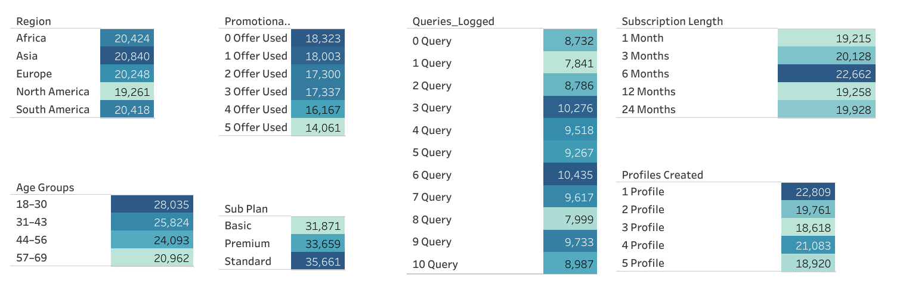
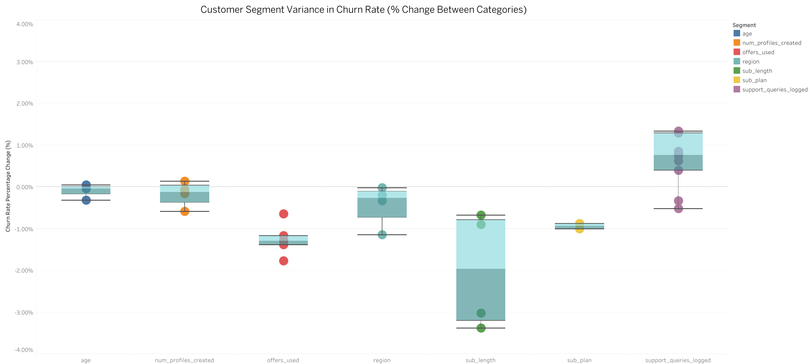

# Project Background
Netflix has been seeing an increasing churn rate amongst their subscribers. The goal of the project is to find factors that lead to Netflix user churn rates using a given dataset on consumer information and interaction. Insights from identified churn rates and how they affect segmented groups will inform recommendations to the marketing team to target advertising campaigns to adhere to these with higher churn rates than others.

### Insights and Recommendations are provided on the following areas:

- **Churn Cause Analysis**: Determining and analyzing the outlying factors that cause a Netflix subscriber to cancel their subscription, pinpointing reasons that have the greatest churn cause in each customer segment.
- **Retention Challenges and Trends**: -	Customer Retention Rates are analyzed to discover trends in subscription maintenance, determining average retention rates and best-performing properties in retaining customers, according to customer segmentation. 
- **Subscription Price Analysis**: Using sales data from subsciption price per region and plan price to guide marketing decisions and determine Average Revenue per user (ARPU).

### The following project deliverables will be provided:

- **Data Cleaning Notebook** for process reproducability and checking data integrity, including a documentation log on changes made and solutions to unfixable data issues, excel functions used, and a final cleaned excel file.
- **Analysis Notebook** to organize analysis, answer key business questions, and provide the step-by-step thought processes to found insights and recommendations.
- **Executive Summary and Insight Deep Dive (this README.md file)** to create a final deliverable for stakeholders including industry-relevant insights, accompanied by visualizations

# Executive Summary

Working with Netflix’s Marketing team, two datasets containing user (`netflix_user_data.csv`) and price planning data (`country_sub_fee.csv`) was gathered to answer business questions in the primary areas of analysis, shown above. Analysis efforts revealed first-time users having a 10% higher churn rate than long-term subscribers, promotional offer use having a positive correlation with higher subscription lengths, with churn rate decreasing by 1-2% whenever customers use a promotional offer. Furthermore, sales pricing data is incorporated, with findings showing Europe to have the most revenue generated and highest ARPU at $167.97 average value for premium subscribers in Europe, while Africa with the lowest revenue generated and ARPU. Insight deep dives show findings within each customer segment, and the marketing team are recommended to allocate resources to certain campaigns targeting both high-churn-risk and profitable segments.  

A variety of tools were used during the entire data process, with Excel Spreadsheets for data cleaning and validation checks, SQL to answer business questions relating to the project areas as noted above, and Tableau to create a dashboard and any accompanying visualizations in the sections below.

# Insight Deep-Dive

## Churn Cause Analysis

The first two analysis questions tackled reasons behind customer churn, determining primary causes of churn so the marketing team can direct efforts towards those customer segments. 

Since no time series was given, the first objective of analysis was to determine which category within each customer segment churned the most. This was done through taking the entire dataset and analyzing each customer segment separately, splitting them into their categories, and comparing the number of customers who churned in each category, highlighting key comparisons through a series of heatmaps. For example, a customer segment would be their age, and each category would be age groups. Refer to customer segmentation in-depth in the analysis notebook [**here**](notebooks/analysis_notebook.md).

#### Churn Causes and Variance Trends

