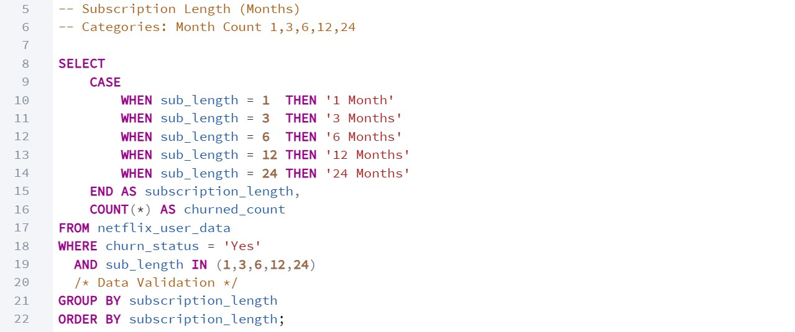
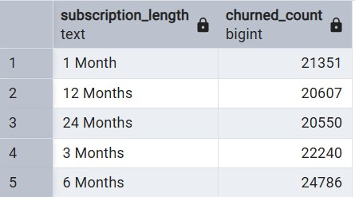
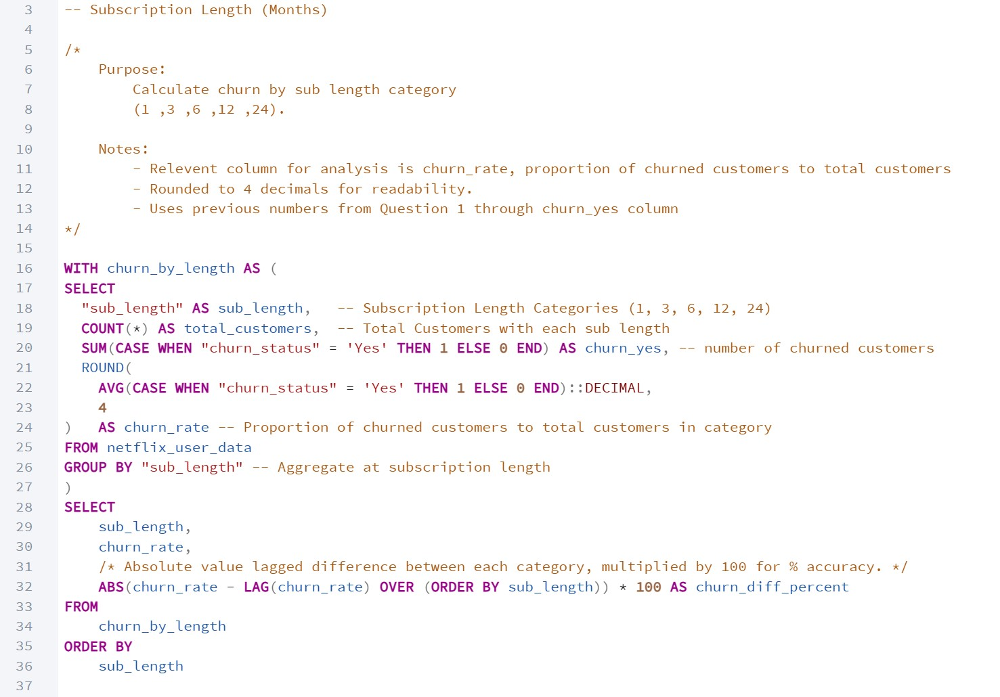
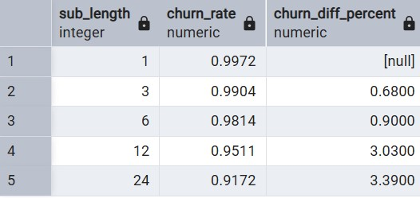
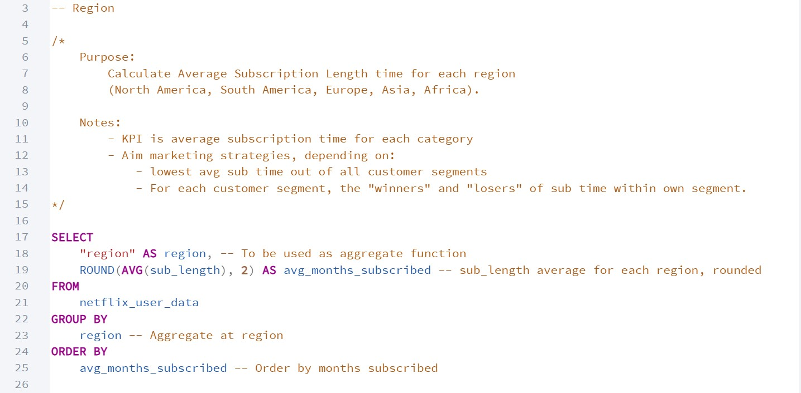
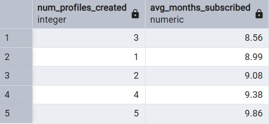
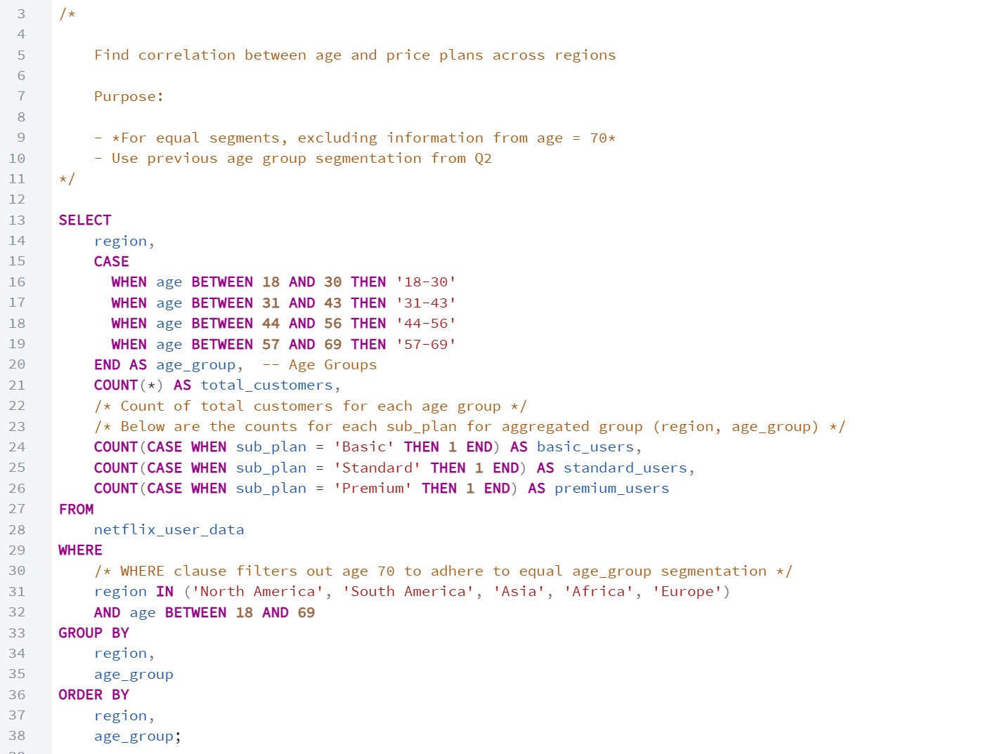
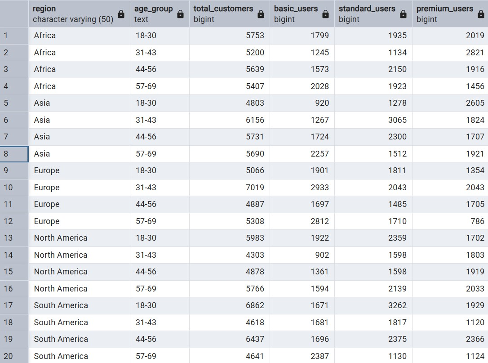
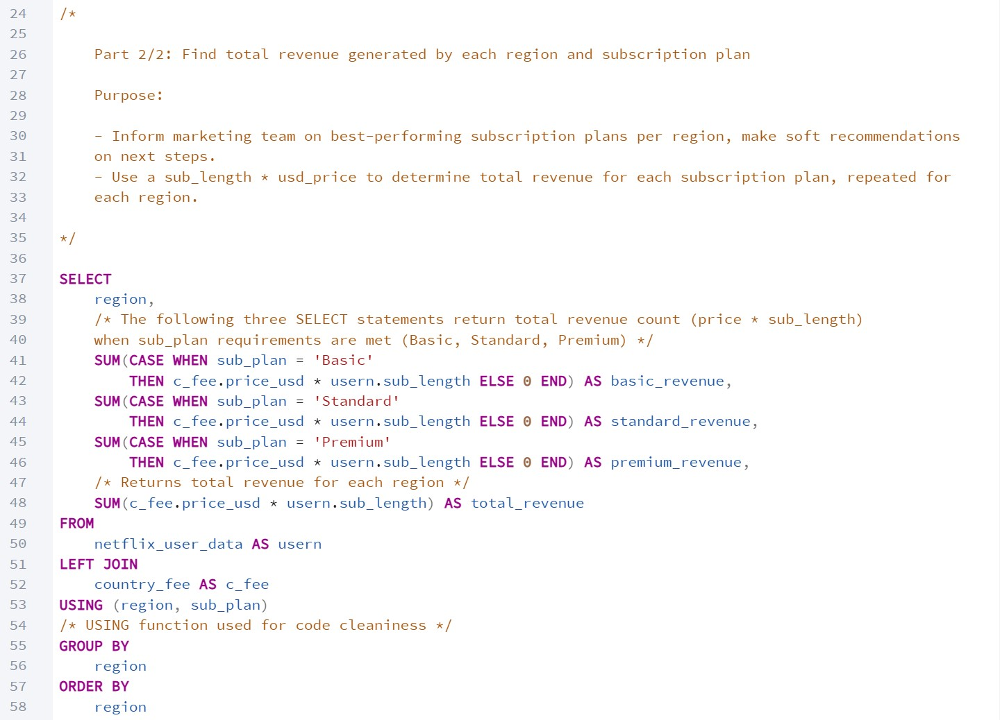
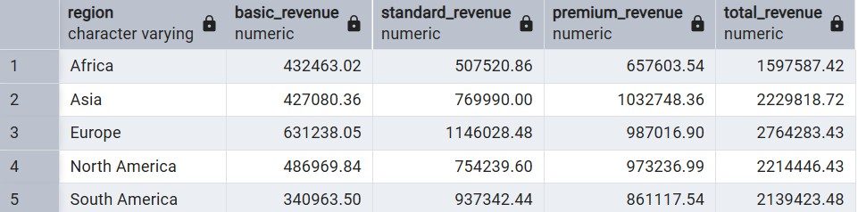

# Data Analysis Notebook

## Introduction

The goal of this markdown notebook is to outline the processes of analyzing each business questions, from reasoning to code references. Note that this notebook only skims the results and processes of the analysis, as insight deep dives and recommendations are made in the primary `README.md` file of this github repository.

## Summarization of Analysis Efforts and Business Questions

Data analysis will be conducted with the goal of extracting insights from the cleaned dataset to provide answers to the relevant business questions, allowing for further insight deep dives and recommendations to stakeholders. Data analysis will be done mostly with Structured Query Language (SQL) using PostgreSQL PgAdmin 4, with Excel spreadsheets used for basic visualizations used to help during analysis. (or just send ss of data output in postgresql)

The following are the key business questions that will be explored and insights found for during analysis:

<b>1.</b> What are the main factors correlated to customer churn for each of the defined customer segments? 

<b>2.</b> For each customer segment, is there an identifiable trend or relationship to why a customer churns, according to their categories?

<b>3.</b>  On average, how long does a subscriber of each segmented group stay subscribed for?

<b>4.</b> Does age influence the likelihood of subscribing to higher-priced plans across different regions?

<b>5.</b> What is the estimated monthly revenue generated by each region and subscription plan?

Deliverables for each question analysis will be a description of the question, a SQL query annotated describing the contents of the query, and finally an outcomes section, which summarizes the data findings. Accompanying visuals will be included in the executive summary in the primary README.md file, created through Tableau.

## Customer Segmentation

Sections of customer information columns are segmented into subgroups within the column of customer information, as outlined above with the "age" column example. See below for the customer segments used during analysis:

- <b>Subscription Length (Months)</b>
	- Analyzing churn rate from early subscription cancellations (1-6 months), to long-term subscribers churning (12-24 months)
- <b>Region</b>
	- Analyzing churn rate in different regions (North America, South America, Europe, Asia, and Africa)
- <b>Subscription Plan Type</b>
	- Analyzing churn rate for different plan types (Basic / Standard with ads, Standard, Premium)
- <b>Support Queries Logged</b>
	- Analyzing churn rate between little to no reports (0 - 3), a decent amount of reports (4 - 6), to several reports (7 - 10) logged.
- <b>Age<b>
	- Analyzing churn rate between age groups: Young Adults (18-31), Adults (32-44), Older Adults (45-57), Seniors (58-70).
- <b>Promotional Offers Used</b>
	- Analyzing churn rate to measure effectiveness of promotional offers in retention, ranging from 1 to 5 promotional offer usage.
- <b>Number of Profiles Created</b>
	- Analyzing churn rate from single-user accounts, couple accounts, and three and more (family accounts).

# Analysis Section

### Question 1: What are the main factors correlated to customer churn for each Customer Segment?

The goal of this section is to identify the leading reasons why a Netflix user would cancel their subscription in relation to each distinguishing customer segment, as defined above. Information to answer the primary question will be found using SQL queries to analyze each customer segment individually, including churn number and average churn percentage of each group within each column.

The deliverables to answer this question will be <b>eight SQL queries that will show the main factors that contribute to customer churn, for each customer segment, using the COUNT SQL function.</b> In this markdown file however, to keep length shorter, the SQL query for the first column (subscription length) will be shown, accompanied by a breakdown of the query's purpose. The other seven SQL queries can be found in this `.sql` file "here".

Purpose for Analysis:
- Give the marketing team a quick look on which customer segment's categories have the most churned users within their own segment alone.

#### Subscription Length (Months)

The following SQL query returns the amount of times a customer churned for each subscription length segment, including each column value for a customer's subscriptions in months (1, 3, 6, 12, 24).

Outcomes:

Below are each customer segment and the factor within the groups which had the most churn cases:

Subscription Length:
- Users churned the most around the six month mark.

Region
- Users churned the most in Asia.

Subscription Plan Type:
- Users churned the most when subscribed to the standard plan.

Support Queries Logged
- Users churned the most when they logged six support queries. 

Age
- Users churned the most between the ages of 18 - 30 (Young Adults)

Promotional Offers Used
- Users churned the most when used between 0 - 1 promotional offers.

Number of Profiles Created
- Users churned the most when their accounts only had one profile (single user).

---

### Question 2: For each customer segment, is there an identifiable trend or relationship to why a customer churns, according to their categories?

The goal of this section aims to determine if there is an identifiable trend according to each customer segment's categories, and if there is a relationship, to determine its significance. 

The deliverables for this question will be <b>eight SQL queries that add on from the last question, using the churn_yes values from Q1 to determine a percentage proportion to total customers with each category. Furthermore, a LAG window function allows to show percentage change between each category, according to the proportions found previously.</b> Identical to the last question, the example for Subscription Length will be shown to keep the sections short, accompanied by a query's purpose.

Purpose for Analysis: 
- Determine variability in churn reasons, using stronger trends to inform the marketing team of which segment's categories churn most in comparison to others.

#### Subscription Length (Months)

The following SQL Query returns each category as records, total customers for each subscription length category, the number of churned customers per category, and a proportion of churned to total customers, for each category in a table.

Outcomes:

Subscription Length 
- A less than 2% change in churn rate happened between 1 - 6 months.
- A larger change of 6% in churn rate happened after 6 months, proceeding until the 24th month mark (3% change between each group).
- Churn rate decreased by over 8% between first-time subscribers to long-term (24+months), <b>signaling significant change and trend.</b>

Region
- A change of approximately ~1.7% in churn rate between all five regions was observed.
- Churn rate had little variance in between regions, <b>signaling a weak trend.</b>

Subscription Plan Type
- a change of 2% between subscription plan types was observed.
- A steady ~1% increase between subscription plans, starting from Standard > Premium > Basic, <b>signaling a weak trend</b>

Support Queries Logged
- Churn rate had a difference of 7% between them, with a gradual increase of 0.7-1.3% for each query logged.
- Churn rate had significant variance, <b>signaling a strong trend.</b>

Age
- Under a 0.5% variance between the age groups, with the largest jump of 0.32% between adults and older adults.
- Churn rate had little variance between age groups, <b>signaling a very weak trend.</b>

Promotional Offers Used
- A change of over ~5% found between 0 - 5 offers used, decreasing by 2-3% between each group. 
- Churn rate had a medium amount of variance between groups, <b>signaling a moderate trend.</b>

Number of Profiles Created
- A change of under 2% was found between them, with between 0.1-0.5% decrease with each user profile created within an account.
- Churn rate had little variance, <b>signaling a weak trend.</b>

---

### Question 3: On average, how long does a subscriber of each segmented group stay subscribed for?

The goal of this section is to determine, for each customer segment and their respective categories, how long they stay subscribed for before churning. 

The Deliverables for this question will be <b>seven SQL queries that aggregate their selected customer segment, then finds the average subscription time for each segment's respective categories. </b>

Purpose for Analysis: 
- Finding average subscription times for a customer segment's categories and overall number could inform marketing decisions that would employ campaigning efforts towards customers within the "danger zone" of churning. 
- Inform the Marketing Team on the average subscription life-span of a churned user.

#### Region

The following SQL Query returns the average subscription time for each region, ordered by the average subscription length for each region.

Outcomes:

Region
- Europe had the highest subscription retention rate at 9.74 months, while Africa had the lowest at 8.43 months.

Subscription Plan Type
- Standard Plan had the highest subscription retention rate at 9.51 months, while Premium had the lowest at 8.76.

Support Queries Logged
- Users had the highest subscription retention rate at 7 Support Queries Logged at 11.4 months, with 9 queries logged had the lowest at 7.66 months.

Age
- Senior users (57 - 69) had the highest subscription retention rate at 9.61 months, while young adult users (18 - 30) had the lowest at 8.67 months.

Promotional Offers Used
- Users who've used 4+ offers have the highest subscription retention rate at 10.33 months, while users who've used 0 offers have the lowest at 8.54 months.
- Note: Even with the seeming trend of used offers = higher retention, note the 8.55 month retention average at 5+ offers used.

Number of Profiles Created
- Accounts with 5+ profiles (indicating a family account) has the highest subscription retention rate at 9.86 months, while accounts with 3 profiles had the lowest around 8.56 months.

---

### Question 4: Does age influence the likelihood of subscribing to higher-priced plans across different regions?

The goal of this section is to determine the relationship between age-range and purchasing higher-priced plans for each region. Analysis will use previous age group customer segmentation as used in previous questions.

The deliverables for this question will include <b>one SQL query which aggregates based on age-range, followed by subscription plan names in the columns, repeated for each region.</b> The content of the temporary table will measure total count of customers in each category to measure differences in subscription plans bought.

Note
- An alternative SQL query is given below which displays the same information, but for one region only. This SQL query is for an alternative view of the same data, with the viewer having to change the region in the WHERE clause to view each region separately.

Purpose of Analysis:
- Determine which age groups purchase which plans (Do middle-aged adults purchase more premium plans than younger adults?)
- Use insights to guide the marketing team on age-based ad campaigns, to be used with insights from Q1 and Q2. 

#### Q4 SQL Query

The following SQL Query returns the counts and average subscription price paid for each age group and subscription into an aggregated table for North America.

Outcomes:
All results are in a single query, however, this outcomes section will be broken into five for each region. Recognizable trends will be noted.

North America
- Basic
	- Gradually less Basic users with increasing age.
- Standard
	- More users at Young Adult and Senior, with a dip in standard users during midde age.
- Premium
	- Gradually more Premium users with increasing age.

South America
- Basic
	- Stagnant for first three age groups, sudden spike with seniors.
- Standard
	- Noticeable fluctuations between age groups on standard subscriptions.
- Premium
	- Noticeable fluctuations between age groups on premium subscriptions.

Europe
- Basic
	- Large fluctuations between age groups on basic subscriptions.
- Standard
	- Noticeable fluctuations between age groups on standard subscriptions.
- Premium
	- Gradually more Premium users with increasing age up until older adult, then sharp decrease at senior.

Asia
- Basic
	- Gradually more Basic users with age
- Standard
	- Drastic increase of standard users in adults, then gradual decrease for next three age groups
- Premium
	- Gradual decrease of Premium users with age, with a small increase at senior.

Africa
- Basic
	- Drastic decrease of basic users in adults, then gradual increase in the next three age groups.
- Standard
	- Larger to smaller fluctuations between age groups on standard subscriptions.
- Premium
	- Drastic increase of premium users in adults, then gradual decrease in the next three age groups.
---

### Question 5: What is the gathered revenue generated by each region and subscription plan?

The goal of this section is to find the total gathered monthly revenue by current and churned users within the provided dataset for each region and subscription plan. 

The deliverables for this question will be <b>one SQL Query that aggregates based on each region and showing total revenue gained for each subscription plan.</b>

Purpose of Analysis:
- Determine total revenue values given by each subscription plan for all five regions, pinpointing top-performing plans in outcomes section.
- Give marketing team insights on plan monetary performance based on region segmentation

#### Q5 SQL Query

The following SQL query returns the total revenue for each subscription plan in their separate regions.

Outcomes:

- Europe generated the most revenue within the given dataset at $2,764,283.43 USD, with Africa at the lowest at $1,597,587.42 USD.
- North America, Asia, and Africa showed a consistent increase of revenue between each plan tier (Basic > Standard > Premium)
- Europe and South America, while sharing the same low trend of basic users as the rest, had more standard users than premium users in their respective regions.

# Conclusion

Next steps of this project will include using the analysis conducted and gathered to provide an executive summary on, an insight deep dive, and a final Tableau dashboard and any accompanying visuals needed to help communicate all findings clearly. All listed components can be found in the primary README.md(link) file in this repository, with additional Tableau public links provided for the dashboard for further use and collaboration. 

