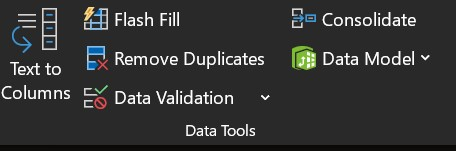
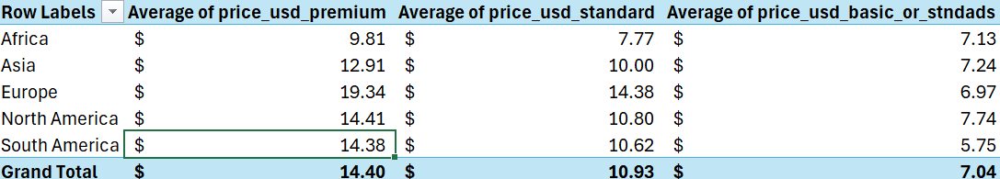

# Data Cleaning Notebook

## Introduction

The goal of this markdown notebook is to show data cleaning efforts in the `netflix_user_data.csv` file, the first of two `.csv` files that contains user information on unnamed users. Deliverables for this notebook include the raw `.csv` file, data cleaning documentation log, summary of cleaning actions and formulas, and a final cleaned `.csv` ready for analysis.

## Summarization of Cleaning Efforts
The following are the actions taken during the cleaning process from the `netflix_user_data_raw` table:

- Rename columns for SQL importing
- Filter out irrelevant columns to business questions
- Remove duplicate records
- Fix typos and inconsistencies 
- Handle null and blank values
- Create new columns to support SQL JOINS and referential integrity 
- Export cleaned dataset

## Data Cleaning and Validation

#### Rename columns for SQL importing

The columns in the `netflix_user_data` table was previously formatted for spreadsheet work only, with column names such as `Subscription Length (Months)` and `Engagement Rate (1-10)`. Although the column names are ideal for non-technical use, the capitalization, extra spaces, and special characters such as brackets make it difficult and wordy for SQL importing and querying. The solution to these column names was a manual change of each column name to include snakecase, non-capitalization, and removing any special characters. The following are the raw column names:

- `Customer ID`
- `Subscription Length (Months)`
- `Customer Satisfaction Score (1-10)`
- `Daily Watch Time (Hours)`
- `Engagement Rate (1-10)`
- `Device Used Most Often`
- `Genre Preference`
- `Region`
- `Payment History (On-Time/Delayed)`
- `Subscription Plan`
- `Churn Status (Yes/No)`
- `Support Queries Logged`
- `Age`
- `Monthly Income ($)`
- `Promotional Offers Used`
- `Number of Profiles Created`

These columns, in respect to industry practice, were changed to:

- `customer_id`
- `sub_length`
- `customer_score`
- `daily_watch_time`
- `engagement_rate`
- `device_used_often`
- `genre_pref`
- `region`
- `payment_hist`
- `sub_plan`
- `churn_status`
- `support_queries_logged`
- `age`
- `monthly_income`
- `offers_used`
- `num_profiles_created`

The significance of changing column names will have little effect for the data cleaning process, but will help simplify query lengths during SQL analysis later in the project. Both renditions of the raw and cleaned column names can be found in the `netflix_user_data_clean` file in the `Netflix-Churn-Project/data` folder.

### Filter out irrelevant columns to business questions

Columns that were irrelevant to answer business questions and objectives were filtered out in a separate spreadsheet to practice data cleanness, identify important metrics in-columns, and to save time during the data cleaning process. Column filtering will be done for both tables, `netflix_user_data` and `netflix_subscription_fee`. The following is the new data schema for data cleaning and further analysis:


Filtering out relevant columns allows for a more time efficient and targeted data cleaning process. The new filtered sheet, `netflix_user_data_filtered`, contains the groups and categories to compare churn rates between, as well as the KPI of `churn_status` being "yes" or "no".

### Remove Duplicate Records

A total of 4921 duplicate records were found in `netflix_user_data`. Duplicate records would've led to an inaccurate representation of the data, and was hence deleted before resuming data cleaning. 

Duplicates were deleted through Excel's "Remove Duplicates" feature under the `Data` menu, as seen below.



The total amount of records before duplicate deletion was 122,965. The deletion of 4921 duplicate records made the total count of unique records to 118,044.

### Fix Typos and Inconsistencies

A significant amount of typos were found during data cleaning, which included data in the following columns:

- `region`
- `sub_plan`
- `customer_id`
- `churn_status`

Most of the typo issues were fixable by using a temporary lookup table within the `netflix_user_data` spreadsheet, containing all unique typo values accompanied by their fixed counterpart to use a `VLOOKUP` function. The following is a short snippet example of using a `VLOOKUP` function in fixing the churn_status column, with the same formula technique being used for fixing typos in sub_plan and region. Note the temporary lookup table created below for typos in churn_status (mispellings of "yes" and "no")

A VLOOKUP nested in an IFERROR function was used to fix the typos via a lookup table and provide an alternative if an error showed up.


``` 
=IFERROR(VLOOKUP(E2,lookups!$G$1:$H$16,2,FALSE), E2)

- Cell E2 signifies the first record in the churn_status column 
- "lookups!$G$1:$H$16" is the location of the temp lookup table 
- IFERROR returns lookup value if no typo is found
```
---
For the `region` column, there was one typo that couldn't be inferred as the rest, which was "Zouth America". This typo could be either north or south America, and were hence 7 rows were deleted to retain data accuracy. 

---
An inconsistency of naming conventions in the `customer_id` column were also present amongst 11 records, for example, "Cx04189", where "x" is the inconsistent format. A trend noticed in the data was that all uncleaned records in the `customer_id` columns were always inferrable as they came in between two other unique customer ids with -1/+1. The 11 records were manually changed to the correct naming convention of "C000000":

```
			Example:		Cx04189 = C004189
```
---

All code formulas for the rest of the `Region` and `sub_plan` can be found in the excel_formulas `md` file through "this link". 

### Handle Null and Blank Values

A total of 8 blank and 6 null value issues were found during data cleaning, which was included in the following columns:

- `region`
- `sub_plan`
- `churn_status`
- `customer_id`
- `support_queries_logged`
- `age`
- `num_profiles_created`

The only fixable problem was in the `customer_id` column for both blank and null values. During data cleaning, both blank values and customer id values that didn't correspond to an ID were inferable to a fully cleaned ID that came before it. In other words, every blank or null value was in between +1/-1 of its customer id, making the blank or null value inferable as the value in between those two numbers:


A series of excel functions were used to handle both blank and null values, utilizing `RIGHT`, embedded `OR` and `TEXT` functions in `IF`, and `CONCATENATE`:

```
(1) =RIGHT(A3,6)
(2) =IF(OR(K3="", K3="###"), TEXT(K2+1, "000000"), K3)
(3) =CONCATENATE("C", 03)

- (1) RIGHT was used to separate "C" from customer_id
- (2) The IF function provided a logical check and return a value
	- The Logic check was if K3 (customer_id records) was blank ("")
	or equal to "###".
	- The value was the previous customer_id plus 1
- (3) CONCATENATE was used to relink the "C" to cleaned customer_id
```
---
The rest of the blank and null values were non-inferable and caused unclean data in key columns for analysis. The existence of these unfixable issues were noted in the documentation log, and were deleted from `netflix_user_data_filtered` and retained in the dirty data spreadsheet for reference. A total of 4369 records were deleted, with a 3.7% magnitude in relation to the entire dataset.

### Clean Subscription Fee Table to support SQL joins

The goal of this section is to gather subscription plan price data based on country, aggregate them into their respective regions as per `netflix_user_data`, then find the average of each plan in each region to support SQL joins from `country_sub_fee` to `netflix_user_data`.

Refer to `country_sub_fee_dirty` to see the raw dataset before the data cleaning process. The following cleaning efforts were committed towards `country_sub_fee`:

- Deleted columns with country price, to include only USD conversions (e.g. no EU currency)
- Changed country names to English, no special characters
- Deleted `mobile_price` column, irrelevant to current analysis since available in less than half of countries
- Used formula (see `excel_formulas`) to returns the value of the basic or standard with ads plan
- Created temporary lookup table to find values from country to region (e.g. Algeria = Africa Region)
- Deleted regions labeled under "Other" (As "other" consists of countries or territories outside of analysis scope)

With the cleaned dataset, average costs of each plan for their respective regions were calculated with an Excel Pivot Table, and the results were imported into a table which will be the final exported dataset to be joined with `netflix_user_data`. 




